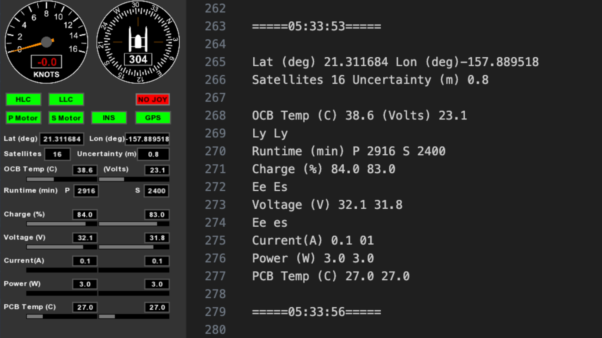

# Table of Contents
1. [Introduction](#introduction)
2. [Getting Started](#getting-started)
    - [Prerequisites](#prerequisites)
    - [Installation](#installation)
3. [Program Use](#program-use)
   - [Running the Program](#running-the-program)
   - [Modifications](#modifications)
   - [Sample Results](#sample-results)
4. [Project Notes](#project-notes)
   - [Difficulties Encountered](#difficulties-encountered)
   - [Reflection and Future Work](#reflection-and-future-work)
5. [Photos](#photos)
# Introduction
This project was developed to automate the recording of data recieved by the ARL WAM-V's Operator Control Unit (OCU) GUI. The OCU natively exports recieved data, though even with trouble shooting and customer service, ARL staff are unable to locate these files. Hence the need to scrape it from the screen using OpenCV and PyTesseract (OCR). This program can act as a standalone screen recorder and screen scraper, and will output a video and txt file.

# Getting Started
## Prerequisites
- [Python](https://www.python.org/) v3.8 through v3.11, [pip](https://pip.pypa.io/en/stable/installation/)
- [Tesseract](https://tesseract-ocr.github.io/tessdoc/Installation.html)
    - Install tesseract using your device's dependency manager (brew, etc) or manually install.
    - After installation, set ensure it is accessible in your Path:
        - On Windows, open your terminal, run `where tesseract`, copy the PATH, and set it as a PATH using `set PATH=%PATH%;C:\your\path\here\`
            - Alternatively, go to search your settings for System Properties -> Environmental Variables -> Select Path in System Variable -> Edit -> New -> Paste your path and confirm.
        - On MacOS / Linux, open your terminal, run `which tesseract`, copy the PATH, and set it as a PATH using `export PATH="$PATH:/path/to/your/directory"`
        - If your Path is set within the terminal, there are temporary changes to your path and will need to be done during every terminal session unless set permanently or handled by your global dependency manager.
## Installation
1. Clone the repository in your desired directory. 
    ```git clone https://github.com/MatthewLabasan/cv-project.git```
2. Navigate to this directory and __[OPTIONAL]__ create a Python virtual environment:
    - Create your virtual environment: 
        ```python -m venv <your_env_name>```
    - Activate it using
        Windows: `<env_name>\Scripts\activate`
        Mac: `source <env_name>/bin/activate`
3. Install packages:
    ```pip install -r requirements.txt```
    - Note: This may take a couple minutes.
# Program Use
## Running the Program
1. Run the program to begin screen capture and text detection:
    ```python main.py()```
2. To exit the program, ensure you are clicked onto the screen recorder window then press the __escape__ key. A .txt file and .mp4 file should now be saved in a data_recordings and screen_recordings folder.
3. [OPTIONAL] Deactivate the virtual environment by running `deactivate` 
4. For future use, utilize the same virtual envionment unless your dependencies are installed to your system. In that case, just run `main.py` from the project's directory.
## Modifications
- Modifying the video's fps can be done in main.py, line 29:
    ```python
     key = cv2.waitKey(1000) # change 1000 to the desired seconds per frame. parameter is in ms.
    ```
    - Increasing the fps may cause performance issues as pyTesseract runs on each frame To disable the OCR, comment out the code below in main.py, line 69:
    ```python
    await python_ocr(np_img, txt_file_name)
    ```
- Screen area to be recorded can be modified by changing the height and width in the `capture()` method in main.py:
    ```python
    async def capture():
    for m in get_monitors():
        width = m.width
        height = m.height
    width = #assign here
    height = #assign here
    screen_size = (width, height) 
    ```
- __NOTE__: Using this function on some macOS devices will record in a lower resolution than what is possible. To ensure full quality, remove the parameters in the above line of code.
## Sample Results


_Frame being read (left), Resulting text (right)_

# Project Notes
## Difficulties Encountered
### Development
__Getting PyTesseract to read specific values__ such as the data in the Knots and Direction values. The Tesseract OCR model is trained on black text over white backgrounds, though it was able to scan everything else in my test images. Things I tried to fix this:
- Utilize Pillow's image modification methods, such as binarizing, erosion, making it grayscale, and resizing
- Isolate specific parts of the image, such as focusing on the GUI only, focusing on the data under the dials, focusing on the dials themself.
    - Interestingly, focusing on the dials still did not allow it to read seemingly easy text (Knots, 304, etc.), so font size did not seem to be the issue.
    - These modifications can be seen in `.\other_implementations\test_programs\cv_exploration\python_ocr.py`
- Tried different OCRs, such as EasyOCR and Keras.
    - I would love to learn about how to train an OCR model to recognize specific data that I am looking for!

__Creating a clean CSV file__ that included data scraped from each frame. How I tried to implement this:
- Obtain the data from OCR, extracting each word's y-coordinate and utilizing that as a way to organize data, since that is how the GUI is structured.
    1. Created a dictionary of keywords, such as lon, lat, uncertainty, etc.
    2. Create a dataframe with time + the keywords as headers
    2. Pass through data once, searching for the words that are similar (80% ratio) to one of the keywords and storing the y-values in a (y-value, keyword) dictionary.
    3. Pass through data again, this time analyzing y-values of each recognized word
        - Compared this y-value to each y-value key in the dictionary
        - If it was within a certain range, get the word associated with y-value key
        - Utilize numPy dataframe, and fill in the first row under the keyword with similar y-value
    - This worked for some data, though it seemed that some values were being overwritten or not recognized when printing the resulting data frame. There must be something wrong with my implementation, as words such as lon was recognized but lat was not.
- Instead, I opted for a .txt file that appends the raw scraped data due to time constraints.
### Onsite Installation
It was difficult to install this as I had only tested installation from MacOS.
- Making sure Tesseract was in path on Windows OS (had to go into settings rather than from terminal).
- Starting a virtual environment (scripts were not allowed on the computer).
- Installing NumPy, as we installed Python's latest version, which the version of NumPy on the `requirements.txt` file does not support.
- Using phone's Hot Spot as wifi made downloads very slow
## Reflection and Future Work
This was a super fun project that taught me a lot about essential computer vision libraries and how to use them. I also learned a lot about making data passing more efficient, and how I can manipulate data (although not done successfully) to create clean information. Some things I'd love to implement in the future include:
- Categorize OCR data by relative coordinates to ensure scalability and standardized data collection (begun implementation in `alternative_processing,py`)
- Implement CSV file creation
- Test utilizing asyncio.gather to allow screen recorder and OCR processing to run at a true 1fps, and finish exporting some x time after escaping the screen recorder
    - Currently, awaiting the OCR stalls video function, which can be seen by the time stamps of the completed .txt file appendage
- Implement a simpler way to insert screen area to be recorded
- Improve OCR through image modifications, etc. so that everything needed from the GUI can be captured.
- Capture time for each frame so that time of data is accurate.
## Photos
See some photos of us running into errors :weary: that we overcame :triumph: :muscle: :pray:, and the WAM-V and MiSos (mini sonars) that were being tested! 


_@dangabrielle Setting up_

_< + slow download speeds..." src="assets/errors.JPG" width="1008" height="736">

_No git + slow download speeds = </3_


_The beach and workstation. Watching the WAM-V!_

 

